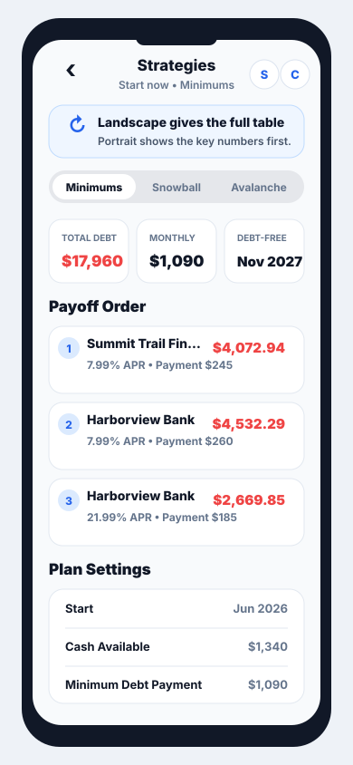

# Compare Strategies Portrait Plan

## Context

The current iPhone portrait version of Compare Strategies keeps the landscape table intact by placing it in a fixed-width horizontal scroll area. This preserves data parity, but the first impression is awkward: the rotate hint dominates the top of the screen, the title competes with Schedule and Chart controls, and the table plus Plan Settings content clips horizontally until the user scrolls sideways.

The goal is not to force landscape. The goal is to make portrait useful by default while still making landscape available for the full table view.

## Recommendation

Keep the landscape table as the full-detail comparison mode, but replace the portrait layout with a portrait-first summary layout.

In portrait, show:

- A smaller, calmer landscape hint.
- Strategy picker near the top.
- Key payoff metrics first.
- Payoff order as stacked rows/cards.
- Plan Settings as a vertical settings list.

In landscape, keep the existing wide table layout.

## Revised Hint

Replace the large orange banner with a compact informational callout.

Suggested copy:

**Landscape gives the full table**  
Portrait shows the key numbers first.

Suggested treatment:

- Use a subtle blue or neutral grouped background, not orange.
- Include a small rotate icon.
- Keep the hint to one compact row/card.
- Avoid alarm styling; this is guidance, not an error.

## Portrait Layout Mockup



Mockup role: proposed iPhone portrait layout only. It shows the direction for portrait summarization while preserving the current wide table for landscape.

## Navigation And Toolbar

The current portrait screenshot shows the title visually squeezed by the Schedule and Chart buttons. For portrait, prefer compact toolbar controls:

- Back button on the left.
- Use a short compact title such as `Strategies` in iPhone portrait so the toolbar has room.
- Keep `Compare Strategies` as the section/sidebar label where space allows.
- Center title and subtitle.
- Icon buttons for Schedule and Chart on the right.
- Accessibility labels should remain `Schedule` and `Chart`.

If text buttons are retained, they should move into a menu or use shorter labels in compact width.

Use slightly smaller type only where width is under pressure: compact portrait title, metric values, and dense payoff-row metadata. Avoid globally shrinking the screen; primary section labels should still read at normal hierarchy.

## Data To Surface In Portrait

Top metrics:

- Total debt.
- Monthly payment for the selected strategy/current plan.
- Projected debt-free month and year.
- Optional: projected interest if space allows.

Payoff order rows:

- Rank/order.
- Account name.
- APR.
- Balance.
- Planned payment.
- Payoff date or unavailable state.

Plan Settings rows:

- Start month.
- Strategy.
- Budget source.
- Cash available.
- Keep for spending.
- Minimum debt payment.
- Reinvestment setting.

## Implementation Sketch

In `DebtSummaryView`, keep the existing table path for landscape or wide widths. Replace the current portrait branch with a new portrait-specific stack.

Likely structure:

```swift
if isPortrait && proxy.size.width < 844 {
    portraitStrategySummary(compact: compact)
} else {
    landscapeStrategyTable(compact: compact, availableWidth: contentWidth)
}
```

Suggested extracted builders:

- `portraitStrategySummary(compact:)`
- `portraitMetricCards()`
- `portraitPayoffOrderRows()`
- `portraitPlanSettingsSummary()`
- `landscapeHintCard(compact:)`

The existing `summaryStack(compact:availableWidth:)` can remain the landscape/wide implementation.

## Acceptance Criteria

- On iPhone portrait, no primary content is clipped horizontally.
- The user can understand the selected strategy without rotating.
- The full table is still available in landscape.
- The hint is visible but not dominant.
- The title does not collide with Schedule or Chart controls.
- Plan Settings is readable in portrait without horizontal scrolling.

## Non-Goals

- Do not force device orientation.
- Do not remove the landscape table.
- Do not redesign iPad/tablet layout unless required by shared code.
- Do not change payoff calculations or plan persistence.
