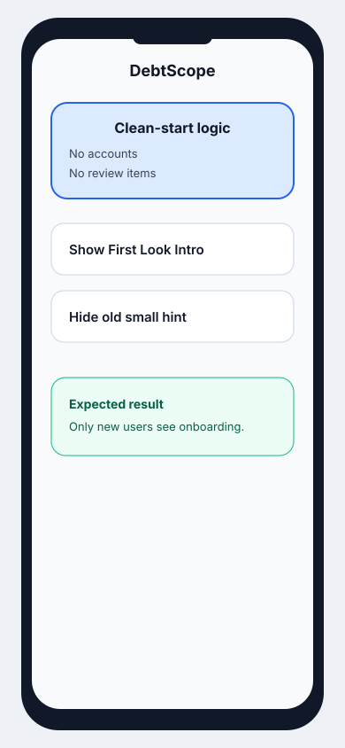
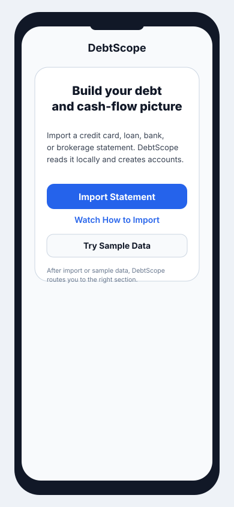
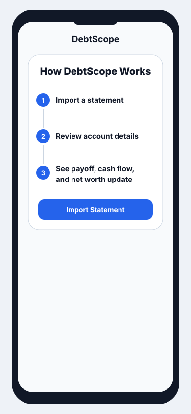
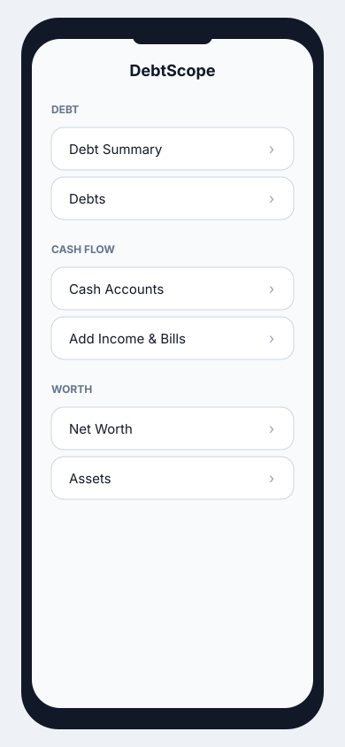
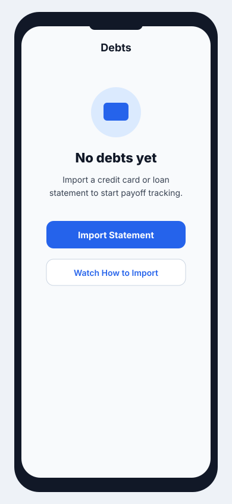
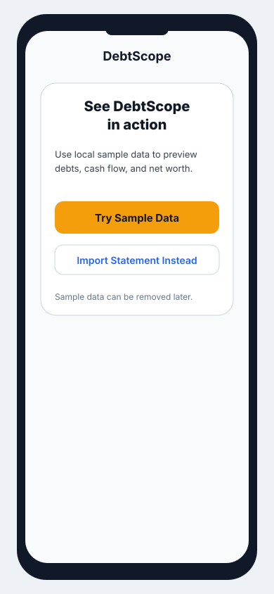

# First Look Implementation Plan

## Goal

Make DebtScope's first launch explain what the app does, why importing matters, and what the user should do next. The first screen should guide a new user from an empty data set to a successful first import without requiring them to infer the workflow from the sidebar.

## Current Problem

`QuickStartView` currently opens directly into the normal app shell. On a clean install, users see section names such as `Payoff Plan`, `Liability Accounts`, `Compare Strategies`, `Net Worth`, and `Income & Bills`, plus a small hint that says to import a statement. That is useful after setup, but it does not clearly answer:

- What does DebtScope do?
- Why should I import a statement?
- Which button should I tap first?
- What happens after import?

Primary file: `DebtScope/View/QuickStartView.swift`.

## Distribution Export

This source plan keeps mockups as linked SVG files so the document and assets remain easy to review and edit. To create a single self-contained markdown file for sharing, run:

```sh
sh DebtScope/Docs/export-first-look-plan.sh
```

The script writes both `DebtScope/Docs/FirstLookImpPlan-embedded.md` and `DebtScope/Docs/FirstLookImpPlan-embedded.html` with the SVG mockups embedded as base64 data-URI images. Open the HTML file in Safari to view the mockups inline. Treat both embedded files as generated send-out artifacts; make edits in this source document and the SVG files, then regenerate them.

## Principles

- Keep the first-launch path short. Do not add a long multi-screen onboarding flow for this pass.
- Make `Import Statement` the obvious primary action in the main content, not only in the toolbar.
- Explain that imports are local/on-device where appropriate, without turning the screen into a privacy policy.
- Preserve existing import routing, statement review, and paywall behavior.
- Avoid changing parser behavior, import limits, purchase logic, or backup behavior in this pass.

## Step 1: Add First-Look State Helpers



Mockup role: conceptual only. Step 1 does not add a visible app screen like the mockup; it adds the state helpers that decide whether the Step 2 first-look intro should be shown. The first user-visible UI begins in Step 2.

### Scope

Add small computed properties in `QuickStartView` to describe the clean-start state.

### Implementation

- Add `private var hasImportedData: Bool` using the existing `accounts` query and `reviewItems` state.
- Add `private var shouldShowFirstLookIntro: Bool` that is true when there are no accounts and no pending review items.
- Keep the existing `shouldShowImportStartHint` temporarily if needed, but avoid showing both the small hint and the new intro at the same time.

Suggested behavior:

```swift
private var hasImportedData: Bool {
    !accounts.isEmpty || !reviewItems.isEmpty
}

private var shouldShowFirstLookIntro: Bool {
    !hasImportedData
}
```

### Acceptance Criteria

- Clean install shows the new first-look intro.
- Existing users with accounts do not see the intro.
- Users with statements waiting in `Needs Review` do not see the generic intro; they should be guided to review instead.

## Step 2: Build The First-Look Intro View



### Scope

Add a prominent inline intro view near the top of the QuickStart sidebar/home content.

### Implementation

- Add a `private var firstLookIntro: some View` in `QuickStartView`.
- Place it above `quickStartGroupedTopicCard` in both `compactQuickStartLayout` and `regularQuickStartLayout`.
- Use the existing import button behavior by setting `showImporter = true`.
- Use `showHelp = true` for the secondary help action.
- Add a tertiary `Try Sample Data` action that routes to the sample-data flow described in Step 7, bypassing statement import for users who want to evaluate the app first.

Suggested copy:

Title:

`Build your debt and cash-flow picture`

Body:

`Import a credit card, loan, bank, or brokerage statement. DebtScope reads it locally, creates accounts, and helps you track payoff, cash flow, and net worth.`

Primary action:

`Import Statement`

Secondary action:

`Watch How to Import`

Tertiary action:

`Try Sample Data`

Optional footnote:

`After import, DebtScope routes you to review or the right section automatically.`

### Design Notes

- Make the primary button visually prominent and full-width on compact layouts.
- The first-look intro is temporary. It should hide after an account exists or a statement is waiting in review, so users then see the normal app sections instead of the intro.
- If the topic list remains visible beneath the intro, keep it visually secondary and avoid making any specific section look like the next required action.
- Prefer standard SwiftUI controls and SF Symbols already used in the file.
- Avoid decorative graphics for this pass.

### Acceptance Criteria

- The primary action opens the same file importer as the toolbar `Import` button.
- The secondary action opens `HelpVideosView`.
- The tertiary action starts the Step 7 sample-data flow without opening the file importer.
- Text wraps cleanly on compact iPhone widths.
- VoiceOver reads the intro in a useful order.

## Step 3: Remove The Old Import Hint

### Scope

Remove the existing small import hint so the new first-look intro is the only empty-data starting guidance.

This is not a separate user-facing screen. It is cleanup work in the same empty-data experience shown in Step 2.

### Implementation

- Remove `shouldShowImportStartHint` if it is no longer needed anywhere else.
- Remove `importStartHint` from `QuickStartView` instead of keeping it as a secondary prompt.
- Remove the `importStartHint` placements from both `compactQuickStartLayout` and `regularQuickStartLayout`.
- Do not replace it with another generic hint. If a future edge case needs guidance, add targeted empty-state copy in that specific destination.

### Acceptance Criteria

- Clean install has one clear first action: `Import Statement` in the first-look intro.
- The old small hint does not appear above or below the first-look intro.
- Pending review and existing-account states route to their normal experiences without showing generic first-launch import guidance.

## Step 4: Add A How DebtScope Works Checklist



### Scope

Explain what happens after tapping import.

### Implementation

Add a compact `How DebtScope Works` checklist inside `firstLookIntro`:

1. `Import a statement`
2. `Review detected account details`
3. `See payoff, cash flow, and net worth update`

### Acceptance Criteria

- A new user can understand the basic workflow without opening Help.
- The checklist remains short enough to scan.
- The checklist does not imply cloud aggregation or bank-login support.

## Step 5: Make Empty Section Labels More Beginner-Friendly



### Scope

Improve first-read comprehension of the main sections without changing app architecture.

### Implementation Options

Preferred small change:

- Change `QuickStartTopic` raw values:
  - `Liability Accounts` -> `Debts`
  - `Asset Accounts` -> `Cash Accounts`
  - `Compare Strategies` -> `Debt Summary`
  - `Physical Assets` -> `Assets`
  - `Income & Bills` -> `Add Income & Bills`

Alternative if existing labels are important elsewhere:

- Keep raw values stable and add a separate `displayTitle` property used only in the QuickStart sidebar.

### Acceptance Criteria

- Navigation destinations and routing still work because topic identity remains enum-based.
- Users see simpler labels in the sidebar/home list.
- No import routing behavior changes.

## Step 6: Add Data-Aware Empty Guidance In Destination Views



### Scope

When users tap a section that does not have enough data yet, the destination should point them to the next useful action instead of showing a generic blank view.

The mockup above is one representative example only. Step 6 is a dynamic behavior rule: the screen changes based on which section the user taps and which categories of data already exist.

### Dynamic Behavior Examples

| User taps | If this data is missing | Show | Primary action |
|---|---|---|---|
| `Net Worth` | assets, property, or investments | `Add assets to see net worth` | `Add Asset` |
| `Cash Accounts` | bank/cash accounts | `Add cash accounts to track cash flow` | `Import Bank Statement` |
| `Debts` | credit-card or loan accounts | `Add debts to build a payoff plan` | `Import Credit Card or Loan Statement` |
| `Add Income & Bills` | income and bills | `Add income and bills` | `Add Income` / `Add Bill` |

Example: if the first import is a credit card and the user taps `Net Worth`, do not open an empty net worth dashboard. Show an empty state explaining that net worth needs assets too, with actions to add a manual asset or import a brokerage statement.

### Implementation

Review these destinations from `topicContent`:

- `DebtPayoffPlanView`
- `DebtPayoffDetailView`
- `DebtSummaryView`
- `CashFlowDetailView`
- `NetWorthView`
- `IncomeAndBillsView`
- `QuickStartAssetsDetailView`

For any destination that currently shows a generic empty state, make sure it includes either:

- An `Import Statement` action when import is the right first step.
- An `Add Asset` action for physical/manual assets.
- A short description of what data is needed.

Keep these as focused empty-state improvements. Do not redesign each destination.

### Acceptance Criteria

- Tapping any first-look section does not lead to a dead end.
- Empty states use the same import path where practical.
- Manual asset flow remains separate from statement import.

## Step 7: Add A Sample Data Path



### Scope

Let users see DebtScope in action using sample data, even before they import their own statement. Step 2 exposes this through `Try Sample Data`, which bypasses the file importer and starts this flow.

### Flow

1. User launches with no data and sees the Step 2 first-look intro.
2. User taps `Try Sample Data` instead of `Import Statement`.
3. DebtScope explains that sample data will create demo accounts, balances, transactions, income, and bills.
4. User confirms.
5. The app inserts clearly labeled sample data using existing SwiftData models.
6. The first-look intro hides because data now exists.
7. The user lands in the normal app with populated debt, cash-flow, and net-worth sections.
8. Settings or the sample-data banner provides a clear `Remove Sample Data` action.

### Implementation

- Add a clearly labeled `Try Sample Data` action from the first-look intro.
- Keep sample data local and deterministic; do not call the parser pipeline or consume import limits.
- Create sample records through the same SwiftData model types the app already uses.
- Mark sample-created records so they can be removed without touching user-created data.
- Add a clear reset/delete path before shipping broadly.

### Acceptance Criteria

- Sample data is clearly labeled as sample data.
- It does not count against real import limits.
- It does not require file access, network access, or a bank statement.
- Users can remove it without deleting real user-entered data.

## End-User Outcome Criteria

- Clean first launch clearly explains DebtScope's purpose.
- `Import Statement` is the dominant first action.
- `Try Sample Data` lets users see DebtScope in action without having a statement ready.
- Users understand the import -> review -> dashboard workflow.
- Empty sections guide users to the right next action instead of showing blank dashboards.
- Existing users do not receive unnecessary onboarding.
